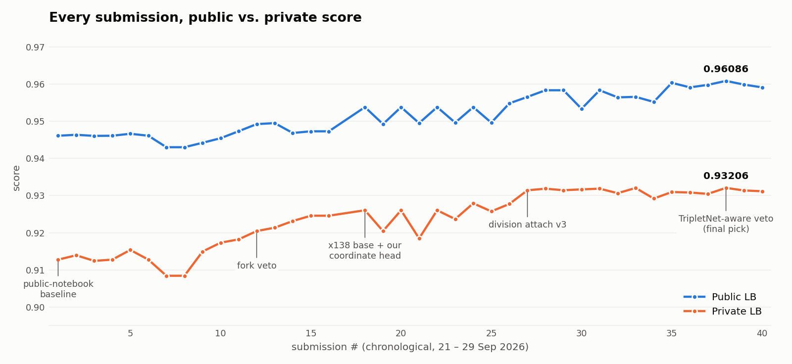
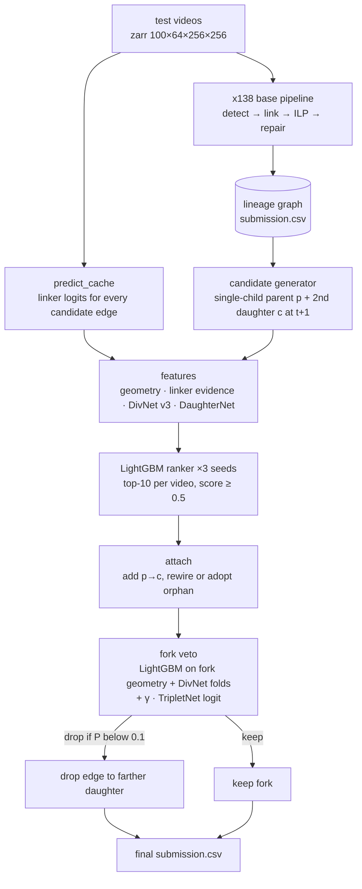

<div align="center">

# biohub-kaggle

**Recovering cell lineages from 3D light-sheet embryo movies — with a division-first post-processing stack that ranks, attaches and vetoes mitoses.**

*A learned candidate ranker adds the missing second daughter to dividing cells; a TripletNet-aware veto removes the forks that aren't real. The final candidates were gated on an honest, by-video out-of-fold test over 195 training videos.*

[](https://www.kaggle.com/competitions/biohub-cell-tracking-during-development/leaderboard)
[](#results)
[](#results)
[](#reproducing)
[](#how-it-works)
[](#how-it-works)
[](LICENSE)

<br>

<picture>
  <source media="(prefers-color-scheme: dark)" srcset="docs/assets/public_vs_private_dark.png">
  
</picture>

<br><br>

| 🥈 **Silver medal** · 68th / 3,950 | 📈 **+0.0193** private vs. the public baseline | 🧬 **3 models** for divisions | 🧪 **195-video** honest CV |
|:---:|:---:|:---:|:---:|

</div>

---

## The competition

[**Biohub – Cell Tracking During Development**](https://www.kaggle.com/competitions/biohub-cell-tracking-during-development)
asks for the full **3D + time lineage** of cells in developing embryos: every cell centre `(t, z, y, x)` in a
100-frame light-sheet volume (64 × 256 × 256 voxels, 1.625 × 0.406 × 0.406 µm), the links between consecutive
frames, and the **divisions** (one node at `t` linked to two at `t+1`). Ground truth is *sparse* — only
a median of ~0.8 % of cells in `44b6` videos and ~10 % in `6bba` videos are annotated — and the leaderboard re-runs the
notebook on a hidden set of unseen videos.

```
score = adjusted_edge_Jaccard + 0.1 · division_Jaccard
```

The edge term dominates, but it is already saturated by the strong public baselines (≈ 0.95 public). What was
left on the table was **divisions**: the public stack recovered a correct fork at only 12 % of true divisions.
This repository is the work that closes part of that gap. See [`docs/METRIC.md`](docs/METRIC.md) for the exact
scoring rules and the break-even arithmetic that drove the design.

## How it works

The base is the public **`biohub-x138`** "Harmonic Fusion" notebook (3D U-Net + node-transformer linker, dual-seed
edge/detection ensemble, bidirectional fusion, ILP lineage solve, safe-division pass). On top of its output graph
we run two extra stages — **attach** and **veto** — in the same Kaggle kernel
([`notebooks/biohub-d8-x3e-tv-g10.ipynb`](notebooks/biohub-d8-x3e-tv-g10.ipynb), cell 11).



**Attach** ([`src/inference/apply_divisions_v2.py`](src/inference/apply_divisions_v2.py)). For every cell with a
single child, candidate second daughters within 13 µm of the parent are enumerated (≈ 80 k per video; among candidates
with any ground-truth evidence only ~1 in 3,800 is a true division). Each is scored by a LightGBM ranker over four evidence families:

| Evidence | Source |
|---|---|
| geometry | parent→daughter and sister distances, symmetry, velocity, track lengths, density |
| linker | the base linker's own `p→c` logit vs. the best competing source for `c` (`predict_cache.py`) |
| mitosis appearance | **DivNet v3** — a 3D U-Net on a 16 × 48 × 48 crop with 4 temporal lags, trained 5-fold by video with mined hard negatives |
| daughter appearance | **DaughterNet** — the same recipe, trained to recognise a daughter cell at the proposed child's position |

The top-10 per video with score ≥ 0.5 are attached (rewiring the old parent edge, or adopting an orphan track start).

**Veto** ([`src/inference/apply_veto.py`](src/inference/apply_veto.py)). Every fork in the final graph — existing
or attached — is re-scored by a LightGBM on fork geometry plus an out-of-fold DivNet logit. The final model adds
**TripletNet**, a classifier of the exact hypothesis *(parent → daughter 1, daughter 2)* with a marker channel at
both claimed daughters, blended as

```
p_keep = σ( logit(p_lgbm) + γ · tripletnet )        γ = 1,   drop the farther daughter edge if p_keep < 0.1
```

The TripletNet term is what made a stricter veto threshold safe: a plain veto at 0.1 *lost* score on the public
board by cutting real forks in the `44b6` embryos; the TripletNet-aware version protects them.

## Results

| | public | private |
|---|:---:|:---:|
| public notebook baseline (`s2`) | 0.94610 | 0.91275 |
| + geometric-fusion rebase, fork veto (`R4`) | 0.94923 | 0.92044 |
| + x138 base and our coordinate head (`X1h`) | 0.95380 | 0.92604 |
| + DivNet v3 / DaughterNet attach (`X3e-t50`) | 0.95834 | 0.93185 |
| **+ TripletNet-aware veto (`X3e-tv`, final pick)** | **0.96086** | **0.93206** |

Public rank **127**, private rank **68** — the honest-CV-first approach held up under the shake-up.
All 40 submissions with both scores are in [`data/submissions.csv`](data/submissions.csv).

Two things the table hides:

- **Early division work was invisible.** `X1h`, `X3` and `X3c-8view` (first-generation attach) read an identical
  0.95380 public / 0.92604 private; only DivNet v3 + DaughterNet moved both boards (+0.0045 public, +0.0058 private).
- **Most clever ideas failed out-of-sample.** Flip-only test-time augmentation looked like +0.013 in-sample and
  scored *below* its base on the leaderboard; a fine-tuned linker lost 0.003. The full list of what moved the
  score and what didn't is in [`docs/EXPERIMENTS.md`](docs/EXPERIMENTS.md).

### Validation: the 195-video big test

Public notebooks' weights were trained on the training videos, so any evaluation on them is in-sample. From
27 Sep on, candidates were therefore scored on **all 195 non-placeholder training videos** (earlier decisions used
smaller held-out sets), with every learned component (rankers, DivNets, TripletNet, veto) trained **5-fold by
video** and scored with the host's official metric, in two brackets: *out-of-sample* linker features (a linker
that never saw that embryo) and *in-sample* ones. Final candidates had to win in both brackets and in both embryo
families (`44b6`, `6bba`); a few exploratory probes (view-policy bets, a readmission probe) went out ungated and
are marked as such in [`docs/EXPERIMENTS.md`](docs/EXPERIMENTS.md).
Details: [`docs/SOLUTION.md`](docs/SOLUTION.md#3-validation).

## Repository layout

```
biohub-kaggle/
├── notebooks/
│   └── biohub-d8-x3e-tv-g10.ipynb   the submitted kernel (private 0.93206): x138 base + attach + veto
├── src/
│   ├── inference/                   code shipped to Kaggle and called by the notebook (as run)
│   │   ├── predict_cache.py           linker logits for every candidate edge
│   │   ├── apply_divisions{,_v2}.py   candidate generation, features, ranker, attach
│   │   ├── divnet_v3_infer.py         DivNet v3 feature at inference
│   │   └── apply_veto.py              fork veto with TripletNet blend
│   ├── models/                      DivNet (v2 reconstruction, hard-negative, v3), DaughterNet scoring, TripletNet, coordinate head
│   ├── ranking/                     candidate generation, linker features, ranker training
│   ├── veto/                        fork-veto training and the official joint test
│   └── validation/                  official-metric harness, big-test and bootstrap scripts
├── docs/
│   ├── SOLUTION.md                  approach, design decisions, validation protocol
│   ├── METRIC.md                    the scoring rules and the arithmetic of adding a fork
│   └── EXPERIMENTS.md               scoreboard of every lever: what worked, what didn't
├── data/submissions.csv             all 40 submissions with public and private scores
└── LICENSE
```

## Reproducing

The notebook is self-contained **on Kaggle**: it mounts the competition data, the public support packs, and a
private weights dataset (`antoniu/biohub-ft-weights`) holding the trained rankers, DivNets, DaughterNet and
TripletNets. **That dataset is private and not part of this repository** (model weights, caches and the
competition data are excluded), so the notebook will not run end-to-end from a clone — retrain with the scripts in
`src/` or substitute your own weights.

`src/models`, `src/ranking`, `src/veto` and `src/validation` are the research scripts archived as they were run.
They import each other and read data through hard-coded paths of the rented GPU box they ran on
(`/workspace/biohub/{analysis,harness,scratch}` and `/workspace/data`); point those at your own checkout to rerun.
`src/validation/score.py` wraps the host's official scorer from
[`royerlab/kaggle-cell-tracking-competition`](https://github.com/royerlab/kaggle-cell-tracking-competition),
which you need to clone separately.

Runtime on Kaggle (T4 GPUs, attach sharded over two): ≈ 5–11 h on the hidden set, guarded by wall-clock deadlines — if the attach or veto
stage fails or runs out of time, the notebook falls back to the last good graph.

## Credits

This solution stands on community work, all public on Kaggle: the
[`biohub-x138`](https://www.kaggle.com/code/anvithpothula/biohub-x138) base notebook (cells 0–10 of the submitted
notebook are that notebook, with minor runtime guards, and remain under their author's terms; the MIT licence
covers the code written for this repository); **pilkwang**'s tracking support pack, temporal U-Net seed
model and DeepCenter prior; **giorgosi**'s DivNet v2 checkpoint; and the competition host's baseline and metric
code ([`royerlab/kaggle-cell-tracking-competition`](https://github.com/royerlab/kaggle-cell-tracking-competition)).
The attach and veto stages, DivNet v3, DaughterNet, TripletNet, the coordinate-refinement head, and the
validation framework are the work in this repository.
